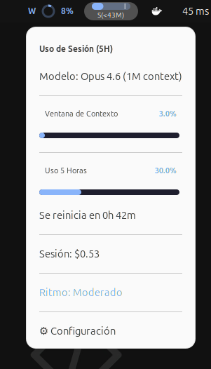
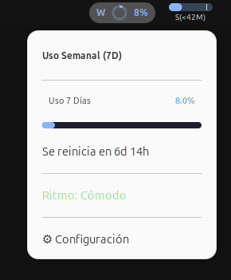
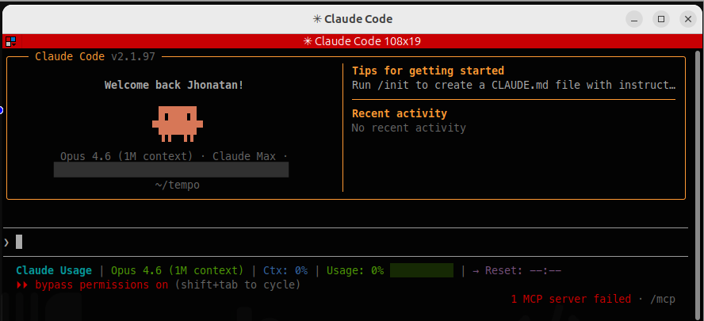

# Claude Usage Tracker for Linux

Monitor your Claude API usage from the GNOME desktop and terminal.

## Screenshots

| Session Usage | Weekly Usage | Session Inline |
|:---:|:---:|:---:|
|  |  |  |

## Features

### GNOME Shell Extension
- Real-time usage tracking (5-hour session and 7-day weekly windows)
- Per-model breakdown (Opus, Sonnet)
- Cost tracking for extra usage
- Pace indicator (6 tiers from idle to blazing)
- Configurable colors (Catppuccin Mocha defaults)
- Dark/light theme support
- Progress bars for visual usage representation

### Tmux Statusline
- Compact usage display in tmux status bar
- File-based caching (60s TTL)
- Claude Code integration via stdin pipe

## Requirements

- GNOME Shell 45+ (Ubuntu 24.04+, Fedora 40+)
- Claude Code CLI with OAuth authentication (`~/.claude/.credentials.json`)
- `curl`, `jq` (for tmux scripts)
- `glib-compile-schemas` (for GNOME extension, usually pre-installed)

## Installation

### Quick Install (everything)

```bash
git clone https://github.com/xpertik/claude-usage-tracker-linux.git
cd claude-usage-tracker-linux
./install.sh
```

### GNOME Extension Only

```bash
./install.sh --gnome
```

### Tmux Statusline Only

```bash
./install.sh --tmux
```

## Configuration

### GNOME Extension

After enabling the extension, open preferences via:
- Right-click on the indicator in the top bar
- Or run: `gnome-extensions prefs claude-usage-tracker@xpertik.com`

Available settings:

| Setting | Default | Description |
|---------|---------|-------------|
| Refresh interval | 300s | How often to poll the API (60-3600s) |
| Notification threshold | 80% | Notify when usage exceeds this |
| Compact mode | off | Show only icon in top bar |
| Show extra usage | on | Display cost section in dropdown |
| Color (normal) | `#89b4fa` | Usage 0-60% |
| Color (warning) | `#f9e2af` | Usage 60-80% |
| Color (critical) | `#f38ba8` | Usage 80%+ |
| Text color | `#cdd6f4` | Label text |
| Background color | `#1e1e2e` | Dropdown panel |

### Tmux Statusline

Add to `~/.tmux.conf`:

```tmux
set -g status-right '#(~/.local/bin/claude-tmux-usage.sh)'
set -g status-interval 60
```

Configure via environment variables:

| Variable | Default | Description |
|----------|---------|-------------|
| `CLAUDE_USAGE_CACHE_TTL` | `60` | Cache TTL in seconds |
| `CLAUDE_USAGE_COMPACT` | `0` | Show only 7d percentage |
| `CLAUDE_USAGE_NO_COLOR` | `0` | Disable colors |

### Claude Code Statusline

For Claude Code integration, use the statusline script:

```bash
~/.local/bin/claude-statusline.sh
```

## Uninstall

```bash
./install.sh --uninstall
```

This removes the GNOME extension, tmux scripts, and cache files.

## How It Works

1. Reads OAuth credentials from `~/.claude/.credentials.json`
2. Calls the Anthropic usage API (`/api/oauth/usage`)
3. Automatically refreshes expired OAuth tokens
4. Displays usage as percentages of the rate limit
5. Caches results to avoid excessive API calls

## License

MIT - see [LICENSE](LICENSE) for details.
